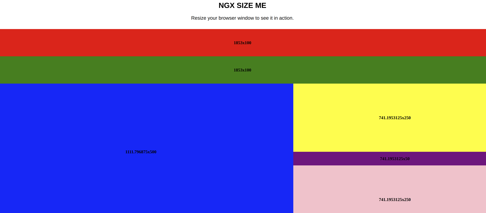

# Ngx Size Me
>Responsive component for Angular, inspired by [react-size-me](https://github.com/ctrlplusb/react-size-me). Lightweight angular directive that makes your components aware of width, height and position.



If you 👍 this project, consider giving it a ★, thanks! 🙌


# Installation
```bash
npm install @eisberg-labs/ngx-size-me --save
```

# Usage

First import to your module:
```typescript
   @NgModule({
     declarations: [
       AppComponent
     ],
     imports: [
       BrowserModule,
       SizeMeModule
     ],
     providers: [],
     bootstrap: [AppComponent]
   })
   export class AppModule { }

```
And use in your component html
```typescript
<div sizeMe (resize)="logResize($event)"></div>
```

# Demo
[View Demo and Documentation](https://www.amarjanica.com/projects/angular-components/documentation/ngx-size-me/Readme.html)


# Api

Option | Data type | Description
-------|-----------|------------
**monitorWidth** | number | if true, any changes to your component's width will trigger a recalculation
**monitorHeight** | boolean | if true, any changes to your component's height will trigger a recalculation
**refreshRate** | number | Frequency of detecting element changes (milliseconds). Default is 16ms.
**refreshMode** | 'throttle' or 'debounce' | Mode in which refreshing should occur.

When recalculation is triggered, directive's state is updated with new width, height and position (left, right, top, bottom).
When a state is updated, component can be notified either by binding an event trigger like:

```typescript
<div sizeMe (resize)="logResize($event)"></div>

```
or by binding updates to a property:
```typescript
<div sizeMe [state]="size"></div>
```

# License

MIT © [Eisberg Labs](https://www.eisberg-labs.com)

