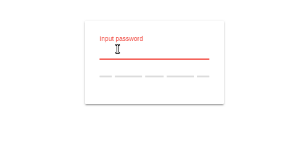

# Ngx Strength Meter
> Angular widget for password strength estimation using [zxcvbn](https://github.com/dropbox/zxcvbn), simple and pretty.



If you 👍 this project, consider giving it a ★, thanks! 🙌


# Installation
```bash
npm install @eisberg-labs/ngx-strength-meter --save
```


## Usage
First import to your module:
```typescript
   @NgModule({
     declarations: [
       AppComponent
     ],
     imports: [
       StrengthMeterModule
     ],
     providers: [],
     bootstrap: [AppComponent]
   })
   export class AppModule { }

```
And use in your component html
```html
<form [formGroup]="form" name="form">
  <mat-form-field>
    <input name="password" matInput placeholder="Input password" type="password" formControlName="password">
  </mat-form-field>
  <strength-meter [value]="form.value.password" (measure)="onStrengthChange($event)"></strength-meter>
</form>
```

# Demo
[View Demo and Documentation](https://www.amarjanica.com/projects/angular-components/documentation/ngx-strength-meter/Readme.html)


# Api

# License

MIT © [Eisberg Labs](https://www.eisberg-labs.com)

